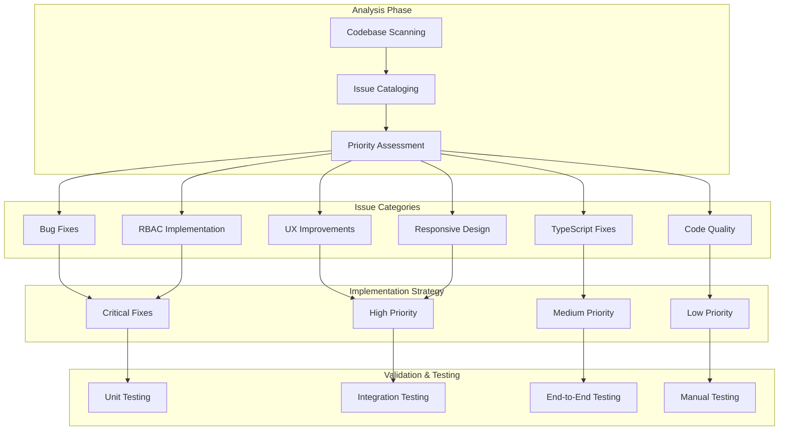

# Design Document

## Overview

The Pekka HR codebase audit and improvement project is designed as a systematic approach to transform the existing HRMS application into a production-ready, maintainable, and user-friendly system. This design outlines a comprehensive strategy for identifying, categorizing, and resolving issues across multiple dimensions: functionality, user experience, code quality, security, and performance.

The approach follows a structured methodology that prioritizes fixes based on severity and user impact, ensuring that critical issues are addressed first while maintaining system stability throughout the improvement process.

## Architecture

### Audit and Improvement Methodology



### Issue Classification Framework

**Severity Levels:**
1. **Critical**: System-breaking bugs, security vulnerabilities, data corruption
2. **High**: Major UX issues, broken workflows, accessibility problems
3. **Medium**: Minor bugs, code quality issues, performance optimizations
4. **Low**: Cosmetic issues, code style improvements, documentation

**Impact Categories:**
- **Functional**: Core business logic and data processing
- **User Experience**: Interface usability and interaction design
- **Technical**: Code quality, maintainability, and performance
- **Security**: Authentication, authorization, and data protection

## Components and Interfaces

### 1. Codebase Analysis Engine

**Purpose**: Systematically scan and analyze the entire codebase to identify issues

**Components:**
- **Static Code Analyzer**: Scans for TypeScript errors, ESLint violations, and code smells
- **Dependency Auditor**: Identifies outdated packages and security vulnerabilities
- **Performance Profiler**: Analyzes bundle sizes, load times, and runtime performance
- **Accessibility Scanner**: Checks for WCAG compliance and accessibility issues

```typescript
interface CodebaseAnalysis {
  typeScriptErrors: TypeScriptError[]
  eslintViolations: ESLintViolation[]
  securityVulnerabilities: SecurityIssue[]
  performanceIssues: PerformanceIssue[]
  accessibilityIssues: AccessibilityIssue[]
  codeSmells: CodeSmell[]
}

interface IssueReport {
  id: string
  category: 'BUG' | 'UX' | 'PERFORMANCE' | 'SECURITY' | 'ACCESSIBILITY'
  severity: 'CRITICAL' | 'HIGH' | 'MEDIUM' | 'LOW'
  description: string
  location: FileLocation
  suggestedFix: string
  estimatedEffort: number
}
```

### 2. Bug Identification and Tracking System

**Purpose**: Systematically identify, categorize, and track bug fixes

**Components:**
- **Bug Scanner**: Automated detection of common bug patterns
- **Flow Validator**: Tests critical user workflows for breaks
- **State Manager Auditor**: Identifies state management inconsistencies
- **API Endpoint Tester**: Validates all API routes for proper functionality

**Key Areas to Examine:**
```typescript
interface BugAuditAreas {
  formSubmissions: FormBugCheck[]
  navigationFlows: NavigationBugCheck[]
  dataProcessing: DataBugCheck[]
  stateManagement: StateBugCheck[]
  apiIntegration: APIBugCheck[]
  componentRendering: RenderBugCheck[]
}

interface BugFix {
  bugId: string
  component: string
  description: string
  rootCause: string
  solution: string
  testCases: TestCase[]
  regressionRisk: 'LOW' | 'MEDIUM' | 'HIGH'
}
```

### 3. Error Handling Enhancement Framework

**Purpose**: Implement comprehensive error handling throughout the application

**Components:**
- **Global Error Boundary**: React error boundary for unhandled exceptions
- **API Error Handler**: Centralized API error processing and user feedback
- **Form Validation Engine**: Comprehensive form validation with user-friendly messages
- **Logging Service**: Structured logging for debugging and monitoring

```typescript
interface ErrorHandlingStrategy {
  globalErrorBoundary: {
    fallbackComponent: React.ComponentType
    errorReporting: ErrorReportingService
    userNotification: NotificationService
  }
  
  apiErrorHandling: {
    errorInterceptor: AxiosInterceptor
    retryLogic: RetryConfiguration
    userFeedback: ErrorMessageService
  }
  
  formValidation: {
    validationSchema: ZodSchema
    errorMessages: ValidationMessageMap
    fieldHighlighting: FieldErrorService
  }
  
  logging: {
    errorLogger: LoggingService
    contextCapture: ContextService
    alerting: AlertingService
  }
}
```

### 4. User Experience Optimization Engine

**Purpose**: Systematically improve user experience across all interfaces

**Components:**
- **UX Audit Tool**: Identifies UX pain points and inconsistencies
- **Loading State Manager**: Implements consistent loading indicators
- **Navigation Optimizer**: Improves navigation flow and breadcrumbs
- **Accessibility Enhancer**: Implements WCAG 2.1 AA compliance

```typescript
interface UXOptimization {
  loadingStates: {
    skeletonLoaders: SkeletonComponent[]
    progressIndicators: ProgressComponent[]
    spinners: SpinnerComponent[]
  }
  
  navigation: {
    breadcrumbs: BreadcrumbService
    sidebarNavigation: NavigationService
    mobileNavigation: MobileNavService
  }
  
  feedback: {
    toastNotifications: ToastService
    modalDialogs: ModalService
    inlineMessages: MessageService
  }
  
  accessibility: {
    ariaLabels: ARIAService
    keyboardNavigation: KeyboardService
    screenReaderSupport: ScreenReaderService
  }
}
```

### 5. Responsive Design Implementation System

**Purpose**: Ensure consistent responsive behavior across all devices

**Components:**
- **Breakpoint Manager**: Standardized responsive breakpoints
- **Layout Optimizer**: Adaptive layouts for different screen sizes
- **Touch Interface Enhancer**: Mobile-friendly interactions
- **Cross-Device Tester**: Automated responsive testing

```typescript
interface ResponsiveDesignSystem {
  breakpoints: {
    mobile: '320px - 768px'
    tablet: '768px - 1024px'
    desktop: '1024px - 1440px'
    widescreen: '1440px+'
  }
  
  layoutPatterns: {
    gridSystems: ResponsiveGrid[]
    flexboxLayouts: FlexboxPattern[]
    containerQueries: ContainerQuery[]
  }
  
  componentAdaptation: {
    navigationAdaptation: NavAdaptation
    tableResponsiveness: TableAdaptation
    formLayouts: FormAdaptation
    cardLayouts: CardAdaptation
  }
  
  touchOptimization: {
    buttonSizing: TouchTargetSize
    gestureSupport: GestureHandler
    scrollBehavior: ScrollOptimization
  }
}
```

### 6. RBAC Implementation Framework

**Purpose**: Implement comprehensive role-based access control

**Components:**
- **Permission Engine**: Centralized permission checking
- **Route Guard System**: API and page-level access control
- **Component-Level Security**: Conditional rendering based on permissions
- **Audit Trail System**: Comprehensive access logging

```typescript
interface RBACImplementation {
  permissionEngine: {
    roleDefinitions: Role[]
    permissionMatrix: PermissionMatrix
    dynamicPermissions: DynamicPermissionService
  }
  
  routeProtection: {
    apiMiddleware: AuthMiddleware[]
    pageGuards: RouteGuard[]
    redirectHandling: RedirectService
  }
  
  componentSecurity: {
    permissionGates: PermissionGate[]
    conditionalRendering: ConditionalRenderService
    secureComponents: SecureComponent[]
  }
  
  auditSystem: {
    accessLogging: AccessLogService
    permissionTracking: PermissionTrackingService
    securityReporting: SecurityReportService
  }
}
```

### 7. TypeScript Error Resolution System

**Purpose**: Systematically resolve all TypeScript compilation errors

**Components:**
- **Type Definition Generator**: Creates missing type definitions
- **Type Conflict Resolver**: Resolves type inconsistencies
- **Strict Mode Compliance**: Ensures strict TypeScript compliance
- **Type Safety Validator**: Prevents type-related runtime errors

```typescript
interface TypeScriptResolution {
  errorCategories: {
    missingTypes: MissingTypeDefinition[]
    typeConflicts: TypeConflict[]
    strictModeViolations: StrictModeViolation[]
    implicitAnyErrors: ImplicitAnyError[]
  }
  
  resolutionStrategies: {
    typeGeneration: TypeGenerationService
    conflictResolution: ConflictResolutionService
    strictCompliance: StrictComplianceService
    safetyValidation: SafetyValidationService
  }
  
  qualityAssurance: {
    typeChecking: TypeCheckingService
    runtimeValidation: RuntimeValidationService
    errorPrevention: ErrorPreventionService
  }
}
```

## Data Models

### Issue Tracking and Resolution

```typescript
interface AuditIssue {
  id: string
  category: IssueCategory
  severity: IssueSeverity
  title: string
  description: string
  location: {
    file: string
    line?: number
    component?: string
  }
  status: 'IDENTIFIED' | 'IN_PROGRESS' | 'RESOLVED' | 'VERIFIED'
  assignee?: string
  estimatedEffort: number
  actualEffort?: number
  resolution?: {
    description: string
    changes: FileChange[]
    testCases: TestCase[]
  }
  createdAt: Date
  resolvedAt?: Date
}

interface FileChange {
  file: string
  type: 'CREATED' | 'MODIFIED' | 'DELETED'
  linesChanged: number
  description: string
}

interface TestCase {
  id: string
  description: string
  type: 'UNIT' | 'INTEGRATION' | 'E2E'
  status: 'PENDING' | 'PASSED' | 'FAILED'
}
```

### Quality Metrics

```typescript
interface QualityMetrics {
  codeQuality: {
    duplicateCodePercentage: number
    codeComplexity: number
    maintainabilityIndex: number
    technicalDebt: number
  }
  
  testCoverage: {
    unitTestCoverage: number
    integrationTestCoverage: number
    e2eTestCoverage: number
    overallCoverage: number
  }
  
  performance: {
    bundleSize: number
    loadTime: number
    firstContentfulPaint: number
    largestContentfulPaint: number
  }
  
  accessibility: {
    wcagComplianceLevel: 'A' | 'AA' | 'AAA'
    accessibilityScore: number
    issueCount: number
  }
}
```

## Error Handling

### Comprehensive Error Management Strategy

```typescript
// Global Error Boundary Implementation
class GlobalErrorBoundary extends React.Component<Props, State> {
  constructor(props: Props) {
    super(props)
    this.state = { hasError: false, error: null }
  }

  static getDerivedStateFromError(error: Error): State {
    return { hasError: true, error }
  }

  componentDidCatch(error: Error, errorInfo: React.ErrorInfo) {
    // Log error to monitoring service
    errorLogger.logError(error, {
      component: 'GlobalErrorBoundary',
      errorInfo,
      userId: getCurrentUserId(),
      timestamp: new Date().toISOString()
    })

    // Send to error tracking service
    errorTracker.captureException(error, {
      tags: { boundary: 'global' },
      extra: errorInfo
    })
  }

  render() {
    if (this.state.hasError) {
      return <ErrorFallback error={this.state.error} />
    }
    return this.props.children
  }
}

// API Error Handling
class APIErrorHandler {
  static handleError(error: AxiosError): never {
    const errorResponse = error.response?.data as APIErrorResponse
    
    switch (error.response?.status) {
      case 400:
        throw new ValidationError(errorResponse.message, errorResponse.details)
      case 401:
        throw new AuthenticationError('Authentication required')
      case 403:
        throw new AuthorizationError('Insufficient permissions')
      case 404:
        throw new NotFoundError('Resource not found')
      case 500:
        throw new ServerError('Internal server error')
      default:
        throw new NetworkError('Network request failed')
    }
  }
}

// Form Validation Error Handling
interface FormErrorHandler {
  validateField(field: string, value: any): ValidationResult
  validateForm(formData: FormData): ValidationResult
  displayErrors(errors: ValidationError[]): void
  clearErrors(field?: string): void
}
```

### Error Recovery Mechanisms

```typescript
// Retry Logic for API Calls
async function withRetry<T>(
  operation: () => Promise<T>,
  options: RetryOptions = {}
): Promise<T> {
  const { maxRetries = 3, baseDelay = 1000, backoffFactor = 2 } = options
  
  for (let attempt = 1; attempt <= maxRetries; attempt++) {
    try {
      return await operation()
    } catch (error) {
      if (attempt === maxRetries || !isRetryableError(error)) {
        throw error
      }
      
      const delay = baseDelay * Math.pow(backoffFactor, attempt - 1)
      await new Promise(resolve => setTimeout(resolve, delay))
    }
  }
  
  throw new Error('Max retries exceeded')
}

// Circuit Breaker Pattern
class CircuitBreaker {
  private failures = 0
  private lastFailureTime = 0
  private state: 'CLOSED' | 'OPEN' | 'HALF_OPEN' = 'CLOSED'
  
  async execute<T>(operation: () => Promise<T>): Promise<T> {
    if (this.state === 'OPEN') {
      if (Date.now() - this.lastFailureTime > this.timeout) {
        this.state = 'HALF_OPEN'
      } else {
        throw new Error('Circuit breaker is OPEN')
      }
    }
    
    try {
      const result = await operation()
      this.onSuccess()
      return result
    } catch (error) {
      this.onFailure()
      throw error
    }
  }
  
  private onSuccess() {
    this.failures = 0
    this.state = 'CLOSED'
  }
  
  private onFailure() {
    this.failures++
    this.lastFailureTime = Date.now()
    
    if (this.failures >= this.failureThreshold) {
      this.state = 'OPEN'
    }
  }
}
```

## Testing Strategy

### Multi-Level Testing Approach

```typescript
// Unit Testing Strategy
interface UnitTestingPlan {
  components: {
    testRenderer: 'React Testing Library'
    mockingStrategy: 'Jest Mocks'
    coverageTarget: 90
  }
  
  utilities: {
    testFramework: 'Jest'
    assertionLibrary: 'Jest Matchers'
    coverageTarget: 95
  }
  
  services: {
    mockingStrategy: 'Dependency Injection'
    testDoubles: 'Stubs and Spies'
    coverageTarget: 85
  }
}

// Integration Testing Strategy
interface IntegrationTestingPlan {
  apiEndpoints: {
    testFramework: 'Supertest'
    databaseStrategy: 'Test Database'
    authenticationMocking: 'JWT Tokens'
  }
  
  workflows: {
    testFramework: 'Jest'
    mockingStrategy: 'Service Layer Mocks'
    dataSetup: 'Factory Pattern'
  }
}

// End-to-End Testing Strategy
interface E2ETestingPlan {
  framework: 'Playwright'
  browsers: ['Chromium', 'Firefox', 'Safari']
  devices: ['Desktop', 'Tablet', 'Mobile']
  
  testScenarios: {
    criticalUserFlows: UserFlow[]
    crossBrowserTesting: BrowserTest[]
    responsiveDesignTesting: ResponsiveTest[]
    accessibilityTesting: AccessibilityTest[]
  }
}
```

### Automated Quality Gates

```typescript
interface QualityGates {
  preCommit: {
    linting: 'ESLint with strict rules'
    typeChecking: 'TypeScript strict mode'
    unitTests: 'All tests must pass'
    formatting: 'Prettier formatting'
  }
  
  preMerge: {
    integrationTests: 'All integration tests pass'
    codeReview: 'Peer review required'
    securityScan: 'Dependency vulnerability check'
    performanceCheck: 'Bundle size analysis'
  }
  
  preDeployment: {
    e2eTests: 'Critical path testing'
    accessibilityAudit: 'WCAG compliance check'
    performanceAudit: 'Lighthouse score > 90'
    securityAudit: 'OWASP security scan'
  }
}
```

This comprehensive design provides a structured approach to systematically audit and improve the Pekka HR codebase, ensuring that all identified issues are addressed in a prioritized manner while maintaining system stability and introducing robust quality assurance measures.