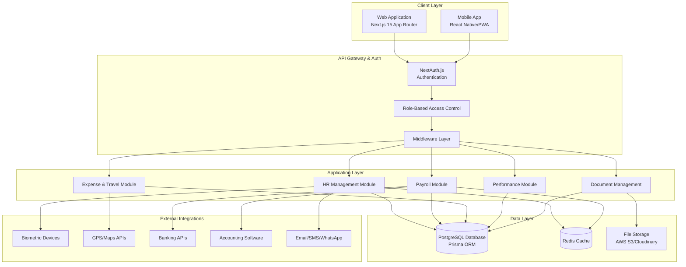
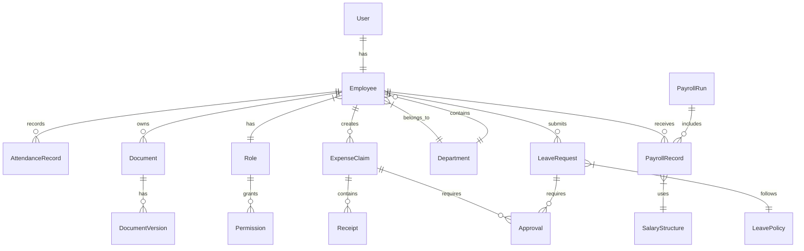

# Design Document

## Overview

The Pekka Hr system is a comprehensive HRMS + Payroll + Travel Management platform built as a modern web application with mobile support. The system follows a microservices-inspired modular architecture using Next.js 15 with App Router, providing both web and mobile interfaces for complete employee lifecycle management.

The architecture emphasizes security, scalability, and maintainability while supporting role-based access control across five distinct user types: Admin, HR, Manager, Finance, and Employee.

## Architecture

### High-Level Architecture



### Technology Stack

**Frontend:**
- Next.js 15 with App Router (TypeScript)
- React 19 with Server Components
- Tailwind CSS + shadcn/ui components
- React Hook Form + Zod validation
- TanStack Query for state management

**Backend:**
- Next.js API Routes (Edge Runtime where applicable)
- NextAuth.js v5 for authentication
- Prisma ORM with PostgreSQL
- Redis for caching and sessions

**Infrastructure:**
- Vercel/AWS for deployment
- PostgreSQL (AWS RDS/Supabase)
- Redis (AWS ElastiCache/Upstash)
- File storage (AWS S3/Cloudinary)

## Components and Interfaces

### Core Modules

#### 1. Authentication & Authorization Module

**Components:**
- `AuthProvider`: NextAuth.js configuration with multiple providers
- `RoleGuard`: HOC for route-level access control
- `PermissionGate`: Component-level permission checking
- `SessionManager`: Server-side session handling

**Key Features:**
- Multi-provider authentication (credentials, OAuth)
- JWT-based sessions with refresh tokens
- Role-based permissions matrix
- Audit logging for all auth events

#### 2. HR Management Module

**Components:**
- `EmployeeProfile`: Comprehensive employee data management
- `OnboardingWorkflow`: Digital onboarding process
- `AttendanceTracker`: Multi-method attendance recording
- `LeaveManager`: Leave request and approval system
- `PerformanceReview`: OKR and 360-feedback system

**Key Interfaces:**
```typescript
interface Employee {
  id: string
  personalInfo: PersonalInfo
  professionalInfo: ProfessionalInfo
  complianceData: ComplianceData
  attendanceRecords: AttendanceRecord[]
  leaveBalances: LeaveBalance[]
  performanceData: PerformanceRecord[]
}

interface AttendanceRecord {
  id: string
  employeeId: string
  checkIn: Date
  checkOut?: Date
  location?: GeoLocation
  method: 'BIOMETRIC' | 'GPS' | 'WEB' | 'MOBILE'
  status: 'PRESENT' | 'LATE' | 'ABSENT' | 'HALF_DAY'
}
```

#### 3. Payroll Management Module

**Components:**
- `PayrollProcessor`: Automated salary calculation engine
- `ComplianceManager`: Statutory compliance handling
- `CTCBuilder`: Configurable salary structure management
- `ReimbursementProcessor`: Claims and reimbursement handling
- `ReportGenerator`: Payroll and compliance reporting

**Key Interfaces:**
```typescript
interface PayrollRun {
  id: string
  period: PayrollPeriod
  employees: PayrollEmployee[]
  status: 'DRAFT' | 'PROCESSING' | 'COMPLETED' | 'FAILED'
  totalGross: number
  totalDeductions: number
  totalNet: number
  complianceData: ComplianceData
}

interface SalaryStructure {
  id: string
  grade: string
  basicSalary: number
  allowances: Allowance[]
  deductions: Deduction[]
  benefits: Benefit[]
}
```

#### 4. Expense & Travel Management Module

**Components:**
- `ExpenseCapture`: Receipt and expense recording
- `TravelPlanner`: Trip request and booking system
- `GPSTracker`: Location-based expense validation
- `ApprovalWorkflow`: Multi-level approval system
- `ReimbursementCalculator`: Automated reimbursement processing

**Key Interfaces:**
```typescript
interface ExpenseClaim {
  id: string
  employeeId: string
  type: 'TRAVEL' | 'FUEL' | 'MEALS' | 'ACCOMMODATION' | 'OTHER'
  amount: number
  receipts: FileUpload[]
  gpsLocation?: GeoLocation
  approvalStatus: ApprovalStatus
  reimbursementStatus: ReimbursementStatus
}

interface TravelRequest {
  id: string
  employeeId: string
  destination: string
  purpose: string
  startDate: Date
  endDate: Date
  estimatedCost: number
  approvals: Approval[]
}
```

### Shared Components

#### 1. Document Management System

**Components:**
- `FileUploader`: Secure file upload with validation
- `DocumentViewer`: In-browser document viewing
- `VersionControl`: Document versioning and history
- `DigitalSignature`: Electronic signature support

#### 2. Workflow Engine

**Components:**
- `WorkflowBuilder`: Visual workflow configuration
- `ApprovalChain`: Dynamic approval routing
- `NotificationService`: Multi-channel notifications
- `TaskManager`: Automated task assignment

#### 3. Reporting & Analytics

**Components:**
- `ReportBuilder`: Configurable report generation
- `Dashboard`: Role-based analytics dashboards
- `DataExporter`: Multiple format export support
- `ScheduledReports`: Automated report delivery

## Data Models

### Core Entities



### Database Schema (Prisma)

```prisma
model User {
  id        String   @id @default(cuid())
  email     String   @unique
  password  String?
  role      Role
  employee  Employee?
  createdAt DateTime @default(now())
  updatedAt DateTime @updatedAt
}

model Employee {
  id               String             @id @default(cuid())
  userId           String             @unique
  employeeCode     String             @unique
  personalInfo     Json
  professionalInfo Json
  complianceData   Json
  departmentId     String
  status           EmployeeStatus
  attendanceRecords AttendanceRecord[]
  leaveRequests    LeaveRequest[]
  expenseClaims    ExpenseClaim[]
  payrollRecords   PayrollRecord[]
  documents        Document[]
  user             User               @relation(fields: [userId], references: [id])
  department       Department         @relation(fields: [departmentId], references: [id])
  createdAt        DateTime           @default(now())
  updatedAt        DateTime           @updatedAt
}

model AttendanceRecord {
  id         String          @id @default(cuid())
  employeeId String
  date       DateTime
  checkIn    DateTime
  checkOut   DateTime?
  location   Json?
  method     AttendanceMethod
  status     AttendanceStatus
  employee   Employee        @relation(fields: [employeeId], references: [id])
  createdAt  DateTime        @default(now())
}
```

## Error Handling

### Error Classification

1. **Validation Errors**: Input validation failures
2. **Authentication Errors**: Login and session issues
3. **Authorization Errors**: Permission denied scenarios
4. **Business Logic Errors**: Rule violations and constraints
5. **Integration Errors**: External service failures
6. **System Errors**: Database and infrastructure issues

### Error Handling Strategy

```typescript
// Global error boundary for React components
class GlobalErrorBoundary extends Component {
  componentDidCatch(error: Error, errorInfo: ErrorInfo) {
    // Log error to monitoring service
    logger.error('React Error Boundary', { error, errorInfo })
    
    // Send to error tracking service
    errorTracker.captureException(error, {
      tags: { component: 'react-boundary' },
      extra: errorInfo
    })
  }
}

// API error handling middleware
export async function errorHandler(
  error: Error,
  request: NextRequest
): Promise<NextResponse> {
  const errorId = generateErrorId()
  
  // Log error with context
  logger.error('API Error', {
    errorId,
    error: error.message,
    stack: error.stack,
    url: request.url,
    method: request.method,
    userId: await getUserId(request)
  })
  
  // Return appropriate error response
  if (error instanceof ValidationError) {
    return NextResponse.json(
      { error: 'Validation failed', details: error.details, errorId },
      { status: 400 }
    )
  }
  
  if (error instanceof AuthenticationError) {
    return NextResponse.json(
      { error: 'Authentication required', errorId },
      { status: 401 }
    )
  }
  
  // Generic server error
  return NextResponse.json(
    { error: 'Internal server error', errorId },
    { status: 500 }
  )
}
```

### Retry and Resilience Patterns

```typescript
// Exponential backoff for external API calls
async function withRetry<T>(
  operation: () => Promise<T>,
  maxRetries: number = 3,
  baseDelay: number = 1000
): Promise<T> {
  for (let attempt = 1; attempt <= maxRetries; attempt++) {
    try {
      return await operation()
    } catch (error) {
      if (attempt === maxRetries) throw error
      
      const delay = baseDelay * Math.pow(2, attempt - 1)
      await new Promise(resolve => setTimeout(resolve, delay))
    }
  }
  throw new Error('Max retries exceeded')
}

// Circuit breaker for external services
class CircuitBreaker {
  private failures = 0
  private lastFailureTime = 0
  private state: 'CLOSED' | 'OPEN' | 'HALF_OPEN' = 'CLOSED'
  
  async execute<T>(operation: () => Promise<T>): Promise<T> {
    if (this.state === 'OPEN') {
      if (Date.now() - this.lastFailureTime > this.timeout) {
        this.state = 'HALF_OPEN'
      } else {
        throw new Error('Circuit breaker is OPEN')
      }
    }
    
    try {
      const result = await operation()
      this.onSuccess()
      return result
    } catch (error) {
      this.onFailure()
      throw error
    }
  }
}
```

## Testing Strategy

### Testing Pyramid

1. **Unit Tests (70%)**
   - Business logic functions
   - Utility functions
   - Component logic
   - API route handlers

2. **Integration Tests (20%)**
   - Database operations
   - API endpoint testing
   - External service mocks
   - Workflow testing

3. **End-to-End Tests (10%)**
   - Critical user journeys
   - Cross-module workflows
   - Mobile app testing
   - Performance testing

### Testing Tools and Frameworks

```typescript
// Jest configuration for unit tests
export default {
  testEnvironment: 'jsdom',
  setupFilesAfterEnv: ['<rootDir>/jest.setup.js'],
  moduleNameMapping: {
    '^@/(.*)$': '<rootDir>/src/$1',
  },
  collectCoverageFrom: [
    'src/**/*.{ts,tsx}',
    '!src/**/*.d.ts',
    '!src/**/*.stories.{ts,tsx}',
  ],
  coverageThreshold: {
    global: {
      branches: 80,
      functions: 80,
      lines: 80,
      statements: 80,
    },
  },
}

// Playwright for E2E testing
test.describe('Employee Onboarding Flow', () => {
  test('should complete full onboarding process', async ({ page }) => {
    // Login as HR user
    await page.goto('/login')
    await page.fill('[data-testid=email]', 'hr@company.com')
    await page.fill('[data-testid=password]', 'password')
    await page.click('[data-testid=login-button]')
    
    // Create new employee
    await page.goto('/employees/new')
    await page.fill('[data-testid=employee-name]', 'John Doe')
    await page.fill('[data-testid=employee-email]', 'john@company.com')
    await page.selectOption('[data-testid=department]', 'Engineering')
    await page.click('[data-testid=save-employee]')
    
    // Verify employee creation
    await expect(page.locator('[data-testid=success-message]')).toBeVisible()
    await expect(page.locator('[data-testid=employee-code]')).toContainText('EMP')
  })
})
```

### Test Data Management

```typescript
// Factory pattern for test data
class EmployeeFactory {
  static create(overrides: Partial<Employee> = {}): Employee {
    return {
      id: faker.string.uuid(),
      employeeCode: faker.string.alphanumeric(8).toUpperCase(),
      personalInfo: {
        firstName: faker.person.firstName(),
        lastName: faker.person.lastName(),
        email: faker.internet.email(),
        phone: faker.phone.number(),
        dateOfBirth: faker.date.past({ years: 30 }),
      },
      professionalInfo: {
        designation: faker.person.jobTitle(),
        joiningDate: faker.date.past({ years: 5 }),
        salary: faker.number.int({ min: 30000, max: 150000 }),
      },
      ...overrides,
    }
  }
}

// Database seeding for tests
export async function seedTestDatabase() {
  const employees = Array.from({ length: 10 }, () => EmployeeFactory.create())
  await prisma.employee.createMany({ data: employees })
  
  const departments = [
    { name: 'Engineering', code: 'ENG' },
    { name: 'Human Resources', code: 'HR' },
    { name: 'Finance', code: 'FIN' },
  ]
  await prisma.department.createMany({ data: departments })
}
```

### Performance Testing

```typescript
// Load testing with Artillery
export const loadTestConfig = {
  target: 'http://localhost:3000',
  phases: [
    { duration: 60, arrivalRate: 10 }, // Warm up
    { duration: 300, arrivalRate: 50 }, // Sustained load
    { duration: 60, arrivalRate: 100 }, // Peak load
  ],
  scenarios: [
    {
      name: 'Employee Login and Dashboard',
      weight: 70,
      flow: [
        { post: { url: '/api/auth/signin', json: { email: '{{ email }}', password: '{{ password }}' } } },
        { get: { url: '/dashboard' } },
        { get: { url: '/api/attendance/today' } },
      ],
    },
    {
      name: 'Payroll Processing',
      weight: 20,
      flow: [
        { post: { url: '/api/auth/signin', json: { email: 'finance@company.com', password: 'password' } } },
        { post: { url: '/api/payroll/run', json: { period: '2024-01' } } },
        { get: { url: '/api/payroll/status/{{ payrollId }}' } },
      ],
    },
  ],
}
```

This comprehensive design provides a solid foundation for building the Pekka Hr system with modern architecture patterns, robust error handling, and thorough testing strategies. The modular design ensures scalability and maintainability while meeting all the requirements outlined in the PRD.